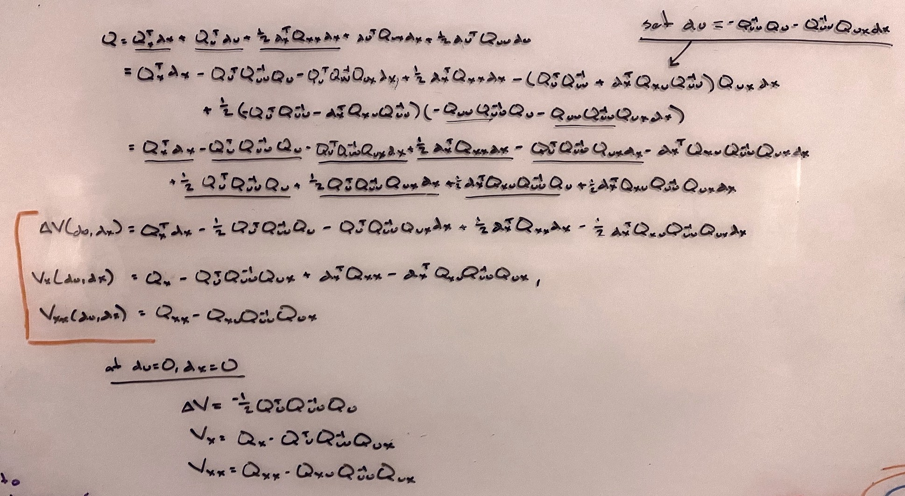

# iLQR ( in principle)

### the idea
In **optimal control** we seek to control a system such that some cost function is minimized. [Some consider this an attractive model for biological motor control](https://homes.cs.washington.edu/~todorov/papers/TodorovNatNeurosci02.pdf) because it helps resolve difficulties associated with the redundancy of biomechanical systems. There are infinitely many ways to solve the same task (e.g. reaching to a target); by casting this as an optimization problem we can "simply" minimize some cost function (e.g. distance to target). This framework predicts that variability will persist along dimensions irrelevant to the cost function, a prediction [that has some experimental support](https://homes.cs.washington.edu/~todorov/papers/TodorovNatNeurosci02.pdf).

For simple systems with linear dynamics and quadratic cost functions there exist well-studied methods for finding (provably) optimal control strategies. [LQR](https://en.wikipedia.org/wiki/Linear%E2%80%93quadratic_regulator) finds a feedback matrix $\mathbf{K}$ that linearly maps the state of the system to control inputs that are optimal with respect to a quadratic cost function (although this is only possible when the system is ["controllable!"](https://www.youtube.com/watch?v=u5Sv7YKAkt4)). Hope is not lost when the dynamics and cost function aren't linear and quadratic. We can use Taylor expansion to find first and second order approximations of the dynamics and cost, then apply LQR methods (albeit without the same theoretical guarantees).

[iLQR](https://homes.cs.washington.edu/~todorov/papers/LiICINCO04.pdf) is an iterative version of LQR (and is slightly simplified version of [Differential Dynamic Programming](https://en.wikipedia.org/wiki/Differential_dynamic_programming)). LQR finds a single feedback rule that linearly maps states to actions; this rule could be defined using an approximation of the dynamics around a single point. But if we stray too far from that point the approximation may fail. In iLQR we iteratively optimize control inputs for *entire trajectories*, defining feedback (and feed-forward) control laws for each time step in the trajectory. Regularization is used to ensure we don't stray too far from the points around which are approximations are made. iLQR can find really impressive behaviors for finite-horizon problems, and can be used for [online trajectory optimization](https://homes.cs.washington.edu/~todorov/papers/TassaIROS12.pdf) if controls are optimized at each timestep for some finite horizon.

### the math
Consider a discrete-time, finite-horizon, deterministic system described at each time $i$ by a state $\mathbf{x}_i$. The system evolves (potentially non-linearly) according to the previous state and action $\mathbf{u}$ (I will use the terms "action" and "control input" interchangeably):

$$
\begin{equation}
\mathbf{x}_{i+1} = \mathbf{f}(\mathbf{x}_i, \mathbf{u}_i)
\end{equation}
$$

Notice that trajectories evolve according to the sequence of actions $U \equiv { \mathbf{u}_0, \mathbf{u}_1, \dots \mathbf{u}_N}$ and the *initial state*. All subsequent states ${ \mathbf{x}_0, \mathbf{x}_1, \dots \mathbf{x}_N}$ unravel deterministically based on the initial state and the control sequence.

Our goal is to maximize the "goodness" (minimize the "badness") of the trajectory. The badness of a trajectory is defined by a cost function of the form:

$$ J_0(\mathbf{x}_0, \mathbf{U}) = \sum_{i=0}^{N-1} \ell(\mathbf{x}_i, \mathbf{u}_i) + \ell_f(\mathbf{x}_N) $$

Notice there are different costs $\ell_f$ and $\ell$ for the final step and all preceding steps. Whereas the cost of the final step is only affect by the state (e.g. the distance of an end effector to a target), the other steps are affected by the state and the control inputs $\mathbf{u}$. This allows us to find efficient policies that penalize excessive control expenditure.

We want to find the control sequence $\mathbf{U}$ that minimizes the cost $J$. To do this we rely on the [principle of optimality](https://en.wikipedia.org/wiki/Bellman_equation#:~:text=Principle%20of%20Optimality%3A%20An%20optimal,See%20Bellman%2C%201957%2C%20Chap.); at each time we pick the action that minimizes the immediate cost plus the sum of future costs, *assuming we behave optimally for subsequent steps*. We will (somewhat confusingly) define the **value** of a state at time $i$ (notice that the value of a state depends on the time!) to be the cost we expect if $\mathbf{U}$ is optimal. Here $J_i$ means we are only considering times from $i \rightarrow N$:

$$
\begin{align}
V_i(\mathbf{x})
&= \min_{\mathbf{U}} J_i(\mathbf{x}, \mathbf{U}) \nonumber \\
&= \min_{\mathbf{u}} [\ell(\mathbf{x}, \mathbf{u}) + V_{i+1}(\mathbf{x_{i+1}})] \nonumber \\
&= \min_{\mathbf{u}} [\ell(\mathbf{x}, \mathbf{u}) + V_{i+1}(\mathbf{f}(\mathbf{x}, \mathbf{u}))] \tag{1}
\end{align}
$$

Remember that the value is *only a function of the state* (because we assumes optimal actions). This means that given current state $\mathbf{x}$, we just need to pick the current best $\mathbf{u}$, which together determine both the immediate loss and the value at the next state. Now we can reason about the optimality of trajectories by sequentially reasoning about the optimality of individual steps. Nice.

So far so good, but how do we pick the best $\mathbf{u}$ at each time. Imagine we start with an initial action sequence $\mathbf{U}$ which determines (together with the initial state) a sequence of states. Now, positioning ourselves at some time $i$ within that trajectory, we are going to build a quadratic approximation of how the argument to $(1)$ changes with $\mathbf{x}$ and $\mathbf{u}$. This approximation is centered around our current $\mathbf{x}_i$, $\mathbf{u}_i$. $V'$ here denotes the value of the subsequent state.

$$
\begin{align}
Q(\mathbf{x}, \mathbf{u})

&= &&\ell(\mathbf{x},\mathbf{u}) + V'(\mathbf{f}(\mathbf{x},\mathbf{u})) \tag{2} \\

&\approx && Q(\mathbf{x}_i,\mathbf{u}_i) + Q_{\mathbf{x}}(\mathbf{x}_i,\mathbf{u}_i)^\intercal (\mathbf{x}-\mathbf{x}_i) + Q_{\mathbf{u}}(\mathbf{x}_i,\mathbf{u}_i)^\intercal(\mathbf{u}-\mathbf{u}_i)\\

&&&+ \frac{1}{2} (\mathbf{x}-\mathbf{x}_i)^\intercal Q_{\mathbf{xx}}(\mathbf{x}_i,\mathbf{u}_i)(\mathbf{x}-\mathbf{x}_i) + (\mathbf{u}-\mathbf{u}_i)^\intercal Q_{\mathbf{ux}}(\mathbf{x}_i,\mathbf{u}_i)(\mathbf{x}-\mathbf{x}_i) + \frac{1}{2} (\mathbf{u}-\mathbf{u}_i)^\intercal Q_{\mathbf{uu}}(\mathbf{x}_i,\mathbf{u}_i)(\mathbf{u}-\mathbf{u}_i)
\end{align}
$$

This equation is awful. We'll clean things up by setting $\mathbf{\delta u}=(\mathbf{u}-\mathbf{u}_i)$, $\mathbf{\delta x}=(\mathbf{x}-\mathbf{x}_i)$ and dropping the $(\mathbf{x}_i,\mathbf{u}_i)$ dependencies. Now our function describes how the value changes as we nudge $\mathbf{x}$ and $\mathbf{u}$ around.

$$
\begin{align}
Q(\mathbf{\delta x}, \mathbf{\delta u})
&\approx Q + Q_{\mathbf{x}}^\intercal \mathbf{\delta x} + Q_{\mathbf{u}}^\intercal \mathbf{\delta u} + \frac{1}{2} \mathbf{\delta x}^\intercal Q_{\mathbf{xx}}\mathbf{\delta x} + \mathbf{\delta u}^\intercal Q_{\mathbf{ux}}\mathbf{\delta x} + \frac{1}{2}\mathbf{\delta u}^\intercal Q_{\mathbf{uu}}\mathbf{\delta u}
\end{align} \tag{3}
$$

We want to find the $\mathbf{\delta u}$ that is the best possible adjustment to our control input, i.e. the one that minimizes the value function. Taking advantage of the fact that this is a quadratic approximation (which has a single extremum), we differentiate $(2)$ w.r.t. $\mathbf{\delta u}$ and set it equal to 0. Keep in mind that all the $Q$ terms are constant.

$$
\begin{align}
\frac{\mathbf{\delta Q}}{\mathbf{\delta u}} &= 0 \\
Q_{\mathbf{u}} + Q_{\mathbf{ux}}\mathbf{\delta x} + Q_{\mathbf{uu}}\mathbf{\delta u} &= 0 \\
\mathbf{\delta u} &= -Q_{\mathbf{uu}}^{-1}(Q_{\mathbf{u}} + Q_{\mathbf{ux}}\mathbf{\delta x}) \tag{4}
\end{align}
$$

Very cool. Distributing $Q_{\mathbf{uu}}^{-1}$ gives us feed-forward and feedback terms $\mathbf{k}$ and $\mathbf{K}$ with which we can update our previous action $\mathbf{u}$ to $\hat{\mathbf{u}}$:

$$
\begin{align}
\mathbf{k} &= -Q_{\mathbf{uu}}^{-1} Q_{\mathbf{u}} \\
\mathbf{K} &= -Q_{\mathbf{uu}}^{-1} Q_{\mathbf{ux}} \\
\hat{\mathbf{u}} &= \mathbf{u} + \mathbf{k} + \mathbf{K \delta x}
\end{align}
$$

Notice that our update depends on $\mathbf{\delta x}$. Although the intitial state will be the same for all trajectories, updates in the control sequence will cause differences to emerge between states at the same time step on successive iterations. We need to keep an eye on this; if we update $\mathbf{U}$ too aggressively we might stray from the region where our quadratic approximation is valid. Regularization will help (see below).

Now we'll compute the coefficients for the quadratic expansion $(3)$. Using the product and chain rules we can differentiate $(2)$ to obtain:

$$
\begin{align}
Q_{\mathbf{x}}  &= \ell_{\mathbf{x}} + \mathbf{f}_{\mathbf{x}}^\intercal V'_{\mathbf{x}} \\

Q_{\mathbf{u}}  &= \ell_{\mathbf{u}} + \mathbf{f}_{\mathbf{u}}^\intercal V'_{\mathbf{x}}\\

Q_{\mathbf{xx}} &= \ell_{\mathbf{xx}} + \mathbf{f}_{\mathbf{x}}^\intercal V'_{\mathbf{xx}}\mathbf{f}_{\mathbf{x}} + V'_{\mathbf{x}}\mathbf{f}_{\mathbf{xx}} \\

Q_{\mathbf{uu}} &= \ell_{\mathbf{uu}} + \mathbf{f}_{\mathbf{u}}^\intercal V'_{\mathbf{xx}}\mathbf{f}_{\mathbf{u}} + V'_{\mathbf{x}}\mathbf{f}_{\mathbf{uu}} \\

Q_{\mathbf{ux}} &= \ell_{\mathbf{xu}} + \mathbf{f}_{\mathbf{u}}^\intercal V'_{\mathbf{xx}}\mathbf{f}_{\mathbf{x}} + V'_{\mathbf{x}}\mathbf{f}_{\mathbf{ux}}

\end{align}
$$

iLQR ignores the second derivatives of $\mathbf{f}$ (the final terms in lines 3-5 above), which will speed things up a lot when using finite differences for derivative calculations. Differential dynamic programming uses all the terms.

Importantly, computing $Q$ at a given time requires knowing $V$ at subsequent times. We will therefore work backwards from the final state, relying on the fact that $V_{\mathbf{x}}$ and $V_{\mathbf{xx}}$ can be easily computed for the final state. But how do we find the $V$ terms? Plugging $(4)$ into $(3)$ we get the following:

$$
\begin{align}
\bigtriangleup V &= -\frac{1}{2} Q_\mathbf{u}^\intercal Q_\mathbf{uu}^{-1}Q_\mathbf{u} \\
V_\mathbf{x} &= Q_\mathbf{x} - \frac{1}{2} Q_\mathbf{u}^\intercal Q_\mathbf{uu}^{-1}Q_\mathbf{ux} \\
V_\mathbf{xx} &= Q_\mathbf{xx} - \frac{1}{2} Q_\mathbf{xu}^\intercal Q_\mathbf{uu}^{-1}Q_\mathbf{ux}
\end{align}
$$

$\bigtriangleup V$ is the change in the value we should expect *if our quadratic approximation is accurate*. This is nice, because we can compare the expected and actual cost reduction during the optimization and use it to guide our regularization strategy. Proving the above equations was a little tedious, but here is the work. The trick is to set $\mathbf{\delta x}=\mathbf{\delta u}=0$ at the end, because this is the point around which our quadratic model is constructed:

#### regularization
The control update $(4)$ uses information about the curvature of $Q$ stored in $Q_\mathbf{uu}$. However, if $Q_\mathbf{uu}$ is non-positive definite then the update may not be in a [descent direction](https://en.wikipedia.org/wiki/Descent_direction). We will therefore regularize $Q_\mathbf{uu}$ by adding to it's diagonal entries:

$$ \tilde{Q}_\mathbf{uu} = Q_\mathbf{uu} + \mu \mathbf{I} $$

The amount of regularization, \mu, will depend on how the optimization is going. When the cost is decreasing we will decrease regularization, and when the cost in increasing (or when $Q_\mathbf{uu}$ is non-PD) we will increase regularization (this is the [Levenberg-Marquardt heuristic](https://en.wikipedia.org/wiki/Levenberg%E2%80%93Marquardt_algorithm#Choice_of_damping_parameter)). The regularization term effectively interpolates between Gauss-Newton optimization - which uses curvature information - and gradient descent. To see this we can rewrite $(4)$ using $\tilde{Q}_\mathbf{uu}$ instead of $Q_\mathbf{uu}$:

$$  -(Q_\mathbf{uu} + \mu \mathbf{I}) \mathbf{\delta u} = Q_{\mathbf{u}} + Q_{\mathbf{ux}}\mathbf{\delta x} $$

As $\mu$ is increased, the feed-forward component of $\mathbf{\delta u}$ is in the opposite direction of the gradient. Importantly, using $\tilde{Q}_\mathbf{uu}$ affects the formulae for $V$. Updated versions of these can be found [here (equations 11)](https://www.google.com/search?q=synthesis+and+stabilization+of+complex+behaviors&oq=synthesis&aqs=chrome.0.69i59j69i57j0l5j69i61.1106j0j4&sourceid=chrome&ie=UTF-8.)

### the algorithm
Putting everything togeher, we are left with the following algorithm:
1. **Compute derivatives** for states and costs along the current trajectory ($\ell_\mathbf{x}, \ell_\mathbf{u}, \ell_\mathbf{xx}, \ell_\mathbf{ux}, \ell_\mathbf{uu}, \mathbf{f_x}, \mathbf{f_u}$). We will need them to compute $Q$ and $V$ in the next step.
2. **Work backwards** from the final time step, at each step computing the control modifications $\mathbf{k}$, $\mathbf{K}$, in addition to $V_\mathbf{x}, V_\mathbf{xx}$.
3. **Compute a new trajectory** using the modified control law. If the cost decreased, keep the new control sequence and decrease regularization; otherwise increase regularization and try the backward pass again.

# iLQR (in practice)
- **Algorithm**: I implemented iLQR as described in [this paper](https://homes.cs.washington.edu/~todorov/papers/TassaICRA14.pdf) (except for some differences described below). Yuval Tassa's [MATLAB code](https://www.mathworks.com/matlabcentral/fileexchange/52069-ilqg-ddp-trajectory-optimization) was a very useful reference. [This Python implementation](https://github.com/studywolf/control/blob/master/studywolf_control/controllers/ilqr.py) was also a useful reference, although it lacked some bells and whistles from the paper.

- **Tasks:**  For fast troubleshooting I started with a custom task in which a point-mass is moved to a target. I then solved a few tasks in the [`dm_control suite`](https://github.com/deepmind/dm_control): point-mass, reacher, and hopper.
I built wrappers for these evnironments, which allowed me to replace the reward functions with cost functions more amenable to iLQR.

- **Differentiation:** To make the algorithm applicable to complex cost functions and dynamics I computed all derivatives use [finite differences], although some derivatives could have been computed analytically for some tasks (e.g. point-mass).

- **Matrix inversion:** Solving for $Q_\mathbf{uu}^{-1}$ directly is computationally very expense. It is better to solve linear systems for $\mathbf{k}$ and $\mathbf{K}$, e.g. use `numpy.linalg.solve()` on $-Q_\mathbf{uu}\mathbf{k} = Q_\mathbf{u}$. Even better, we can first perform a [Cholesky decomposition](https://en.wikipedia.org/wiki/Cholesky_decomposition) on $Q_\mathbf{uu}$, then solve two linear systems, as described in the notes [here](https://numpy.org/doc/stable/reference/generated/numpy.linalg.cholesky.html).

- **$\alpha$ line search:** The original paper uses an additional regularization parameter $\alpha$ that linearly interpolates between the full update and intermediate updates by scaling the feed-forward term: $\hat{\mathbf{u}} = \mathbf{u} + \alpha \mathbf{k} + \mathbf{K \delta x}$. They also use a clever scheme to update $\alpha$ based on the ratio between expected and observed cost reductions. I only used $\alpha$ as a fixed term, and found $\alpha=1$ to work for all experiments presented here.

- **Regularization schedule:** For updated the regularization parameter $\mu$ I used the quadratic modification schedule described in section II.F [here](https://homes.cs.washington.edu/~todorov/papers/TassaIROS12.pdf).
